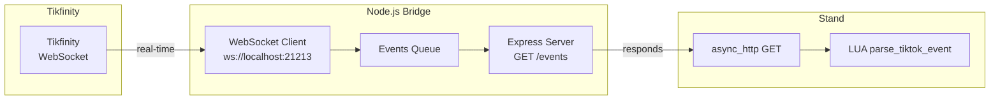

# Tikfinity → Node.js → Standxtikfinity

This project demonstrates how to **bridge** Tikfinity’s WebSocket events into Stand (a GTA V mod menu) using **Node.js** for WebSocket handling and **Lua** for HTTP polling in Stand.

## Overview

1. **`fix.js`**  
   - A Node.js server that connects to Tikfinity’s local WebSocket (`ws://localhost:21213`).  
   - Buffers each incoming event in memory.  
   - Exposes `GET /events` which returns **unread** events as JSON, then clears them from the queue.

2. **`tikfinity.lua`**  
   - A Stand Lua script that **polls** the Node.js server every few seconds, retrieving new events.  
   - Parses each event, displays a message in GTA, and runs a custom Stand command (e.g., chat) using placeholders (`{name}`, `{message}`, `{gift}`).

By separating the **WebSocket** logic into Node.js, we avoid Stand’s lack of built-in WS support while still capturing real-time Tikfinity events.

---

## `fix.js` (Node.js)

A simple Node.js server that:

1. Connects to `ws://localhost:21213/` via the [`ws` library][1].  
2. Collects event messages in a local array (`eventsQueue`).  
3. Hosts an Express-based HTTP server on `http://localhost:3000`.  
4. When clients fetch `GET /events`, it returns **all** queued events and then clears them.

### Example

```js
// fix.js
// 1) Install dependencies: npm install ws express cors
// 2) Run: node fix.js

const WebSocket = require('ws');
const express = require('express');
const cors = require('cors');

const WS_URL = 'ws://localhost:21213';  // Tikfinity WebSocket endpoint
const HTTP_PORT = 3000;                 // Local HTTP server port

let eventsQueue = [];

// Connect to Tikfinity WebSocket
function connectWebSocket() {
  console.log(`Connecting to WebSocket: ${WS_URL}`);
  const ws = new WebSocket(WS_URL);

  ws.on('open', () => {
    console.log('WS connected:', WS_URL);
  });

  ws.on('message', (data) => {
    console.log('WS message received:', data);
    // Store the raw JSON string
    eventsQueue.push(data.toString());
  });

  ws.on('error', (err) => {
    console.error('WS error:', err.message);
  });

  ws.on('close', () => {
    console.log('WS closed. Reconnecting in 3 seconds...');
    setTimeout(connectWebSocket, 3000);
  });
}
connectWebSocket();

// Express HTTP server
const app = express();
app.use(cors());

// Returns all queued events, then clears them
app.get('/events', (req, res) => {
  const toSend = eventsQueue;
  eventsQueue = [];
  res.json({ events: toSend });
});

app.listen(HTTP_PORT, () => {
  console.log(`HTTP server running on http://localhost:${HTTP_PORT}`);
  console.log(`GET /events to retrieve queued events.`);
});
```

#### How to Run
1. **Install Node.js**  
2. **Install dependencies**:  
   ```bash
   npm install ws express cors
   ```
3. **Start** the script:  
   ```bash
   node fix.js
   ```
4. Check that it outputs something like:  
   ```
   Connecting to WebSocket: ws://localhost:21213
   WS connected: ws://localhost:21213
   HTTP server running on http://localhost:3000
   ...
   ```

[1]: https://www.npmjs.com/package/ws (ws library on npm)

---

## `tikfinity.lua` (Stand Lua)

A Stand Lua script that:

1. Lets you **poll** the Node.js bridge server for new events.  
2. **Parses** each event as JSON, extracting `event` and `data`.  
3. **Displays** an in-game toast using placeholders in `message` templates.  
4. **Runs** a custom Stand command to respond, using placeholders in `command` templates.

### Example

```lua
-- tikfinity.lua
local json = require("json")

local bridge_host = "localhost:3000"
local bridge_path = "/events"
local polling = false

-- Event templates
local event_templates = {
    chat = {
        message = "Chat: {name} said: {message}",
        command = "say {name} just chatted: {message}"
    },
    -- ... gift, like, follow, share, subscribe, roomUser ...
}

-- Menu Setup
menu.divider(menu.my_root(), "Tikfinity Bridge (HTTP Polling)")

menu.text_input(
    menu.my_root(),
    "Bridge Host",
    {"tikfinity_bridge_host"},
    "Host:Port for the Node.js bridge.",
    function(val)
        bridge_host = val
        util.toast("Updated bridge host: "..bridge_host)
    end,
    bridge_host
)
menu.text_input(
    menu.my_root(),
    "Bridge Path",
    {"tikfinity_bridge_path"},
    "Path for the Node.js bridge.",
    function(val)
        bridge_path = val
        util.toast("Updated bridge path: "..bridge_path)
    end,
    bridge_path
)

menu.toggle(
    menu.my_root(),
    "Start Polling Events",
    {"tikfinity_poll"},
    "Continuously fetch new events from the Node.js bridge.",
    function(on)
        polling = on
        if on then
            util.toast("Polling started.")
            start_poll_loop()
        else
            util.toast("Polling stopped.")
        end
    end,
    false
)

-- Helper functions
local function replace_placeholders(template, name, message, gift)
    ...
end

local function display_message(txt)
    ...
end

local function execute_stand_command(cmd)
    ...
end

local function handle_event(event_key, name, msg, gift)
    ...
end

function parse_tiktok_event(event_json)
    ...
    handle_event(event_type, name, message, gift)
end

function start_poll_loop()
    util.create_thread(function()
        while polling do
            util.yield(2000) -- poll every 2s
            async_http.init(bridge_host, bridge_path, function(body, header_fields, status_code)
                if status_code == 200 and #body > 0 then
                    local ok, parsed = pcall(json.decode, body)
                    if ok and type(parsed) == "table" and type(parsed.events) == "table" then
                        for _, raw_json in ipairs(parsed.events) do
                            parse_tiktok_event(raw_json)
                        end
                    end
                end
            end)
            async_http.dispatch()
        end
    end)
end

-- Simulate Chat, Gift, etc. in menu.action(...)
```

#### How to Use
1. Place `tikfinity.lua` in your **Stand > Lua Scripts** folder.  
2. **Load** it in Stand’s Lua Scripts menu.  
3. Toggle **Start Polling Events**.  
4. Each time Tikfinity triggers an event, Node receives it via WebSocket, then you retrieve it via `GET /events`.  
5. The script calls `parse_tiktok_event(...)`, showing a toast and running any configured Stand command.

---

## Full Diagram



1. Tikfinity **sends** events over WS to Node.  
2. Node’s `fix.js` **queues** them and **serves** them via `/events`.  
3. Stand’s `tikfinity.lua` **polls** `/events`, then calls `parse_tiktok_event(...)`.

---

## License

You can use or modify these scripts freely to suit your needs. Check Tikfinity’s license and Stand’s usage terms for any additional conditions.

**Happy bridging!**
